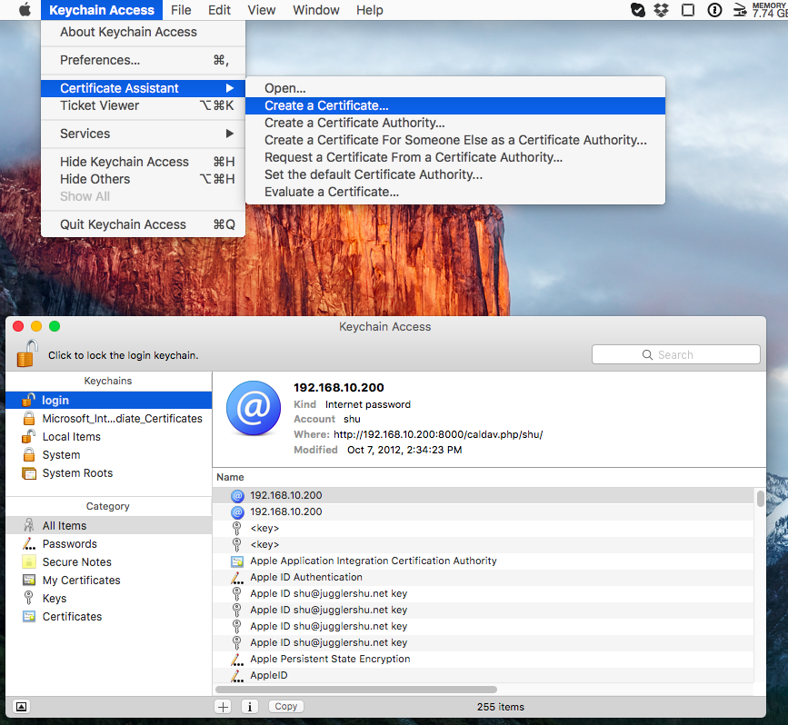
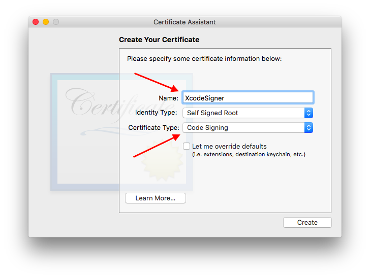

# Install XVim for Xcode 8

Since Apple decided not to load 3rd party plugins, we have to make change to it. What we have to do overall is to re-codesign Xcode. This allows us to load 3rd party plugins. Here's the steps to do.

1. Close Xcode
    
2. Prepare code sign certificate
   
   If you already have a certificate from Apple's developer program you can use it (so skip to next section now). If you don't have one or don't want to use the existing certificate create new one as follows.

   2.1 Open "Keychain Access" (in Applications -> Utilities) and select "login" in the left pane.
   
   2.2 Select Create a Certificate ( in KeyChain Access -> Certificate Assistant )
       

       
   2.3 Input your name (whatever you like) and select "Code Signing" for Certificate Type.
       Not required but the name is used later in a command line so it could be better to use easily distinguishable name here (I use XcodeSigner here).
       

       

  Now you have a certificate to code sign.

3. Re-signing Xcode

   Then in a terminal,

         $ sudo codesign -f -s XcodeSigner /Applications/Xcode.app    (Replace the Xcode path if it is different.)

   This should take a while.
   
4. Build XVim

   Go to XVim directory you cloned and build it as usual (Read INSTALL section in README.md).
